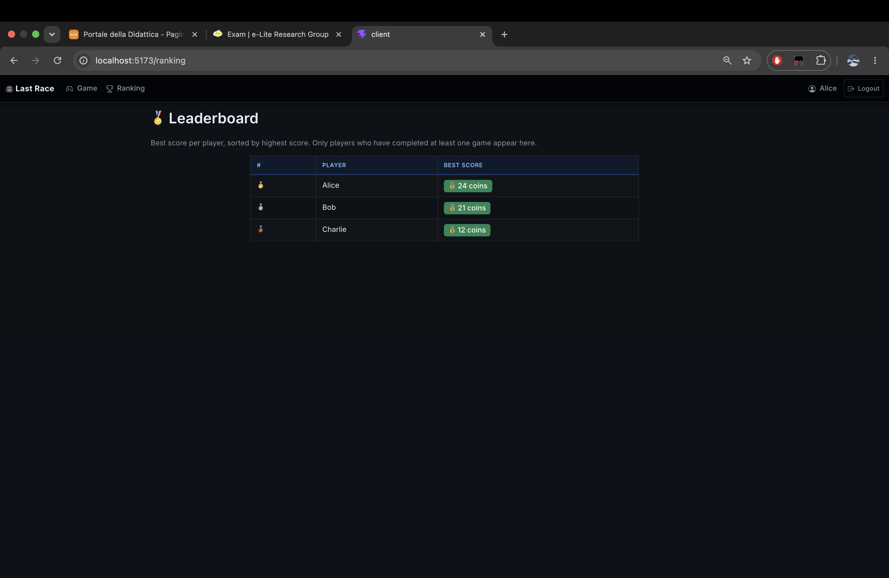
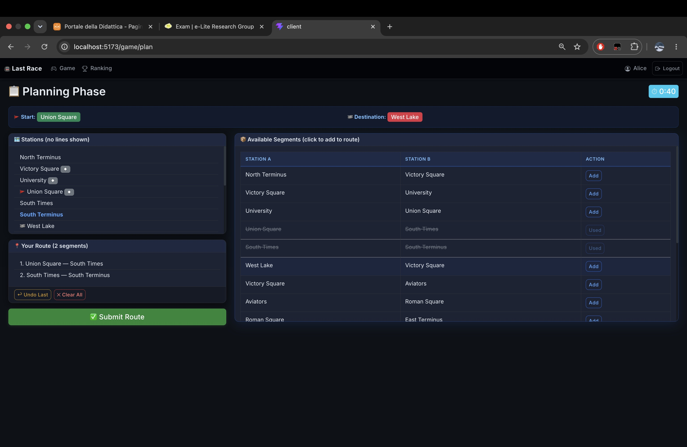

# Exam #1: "Last Race"
## Student: s362761  Cusma Rares

A single-player metro route planning game. Authenticated users plan a route between two randomly assigned stations on a fictional metro network, then ride through it step by step with random events affecting their coin balance.

## React Client Application Routes

- Route `/`: Public home page with game instructions (accessible to all, anonymous included). No metro map shown.
- Route `/login`: Login form with email/password. Redirects to `/game` if already logged in.
- Route `/game`: **Setup Phase** (protected) — Displays the full metro network (lines, stations, segments). Button to start a new game.
- Route `/game/plan`: **Planning Phase** (protected) — 90-second timer. Shows start/end station, list of available segments (without line info). User builds a route by clicking segments.
- Route `/game/execution`: **Execution Phase** (protected) — Manual step-by-step display. Each step shows the segment traveled, the random event, and updated coin balance. "Next Step" button to advance.
- Route `/game/result`: **Result Phase** (protected) — Final score display. Options to play again or view ranking. If route was invalid, shows error message and score 0.
- Route `/ranking`: **Leaderboard** (protected) — Best score per player, sorted descending.
- Route `*`: 404 Not Found page.

## API Server

- POST `/api/sessions`
  - Request body: `{ email, password }`
  - Response: user object `{ id, email, name }` or 401 error
- GET `/api/sessions/current`
  - No parameters
  - Response: current user object or 401 if not authenticated
- DELETE `/api/sessions/current`
  - No parameters (requires authentication)
  - Response: 200 (empty body)
- GET `/api/metro/network`
  - No parameters (requires authentication)
  - Response: `{ lines, stations, stationLines, segments }` — the full metro network (used in Setup Phase)
- GET `/api/metro/segments`
  - No parameters (requires authentication)
  - Response: `{ stations, stationLines, segments }` — segments WITHOUT lineId (used in Planning Phase, to avoid leaking line info)
- POST `/api/games`
  - No request body (requires authentication)
  - Response: `{ gameId, startStation: {id, name}, endStation: {id, name} }`
  - Server randomly selects start/end with BFS distance ≥ 3 segments
- POST `/api/games/:id/submit`
  - Request body: `{ route: [segmentId1, segmentId2, ...] }` (requires authentication)
  - Response: `{ valid, reason?, startingCoins, steps: [{segment, event, coinsAfter}], finalScore }`
  - Validates route connectivity, line changes at interchange stations only, no repeated segments
- GET `/api/ranking`
  - No parameters (requires authentication)
  - Response: array of `{ rank, userId, name, bestScore }` sorted by bestScore DESC

## Database Tables

- Table `user` - contains id, email, name, password (hex-encoded hash), salt
- Table `line` - contains id, name, color (4 metro lines)
- Table `station` - contains id, name (16 stations)
- Table `station_line` - contains stationId, lineId, order (links stations to lines)
- Table `segment` - contains id, station1Id, station2Id, lineId (16 segments, consecutive pairs on each line)
- Table `event` - contains id, description, scoreEffect (8 random events, effects between -4 and +4)
- Table `game` - contains id, userId, startStation, endStation, finalScore, completed, createdAt

## Main React Components

- `HomeInstructions` (in `HomeInstructions.jsx`): Public page with game rules and instructions. Shows "Go to Game" button for authenticated users, "Login to Play" for anonymous.
- `MetroMap` (in `MetroMap.jsx`): Setup Phase — displays metro network with lines, stations, and segments. "Start New Game" button creates a new game.
- `PlanRoute` (in `PlanRoute.jsx`): Planning Phase — 90-second timer, segment selection UI, route builder with undo/clear. Auto-submits at timer expiry.
- `GamePlay` (in `GamePlay.jsx`): Execution Phase — manual step-by-step display of the ride. Shows segment, event, and coin balance per step.
- `GameResult` (in `GameResult.jsx`): Result Phase — final score display. Shows error message for invalid routes. Buttons to play again or view ranking.
- `Ranking` (in `Ranking.jsx`): Leaderboard — fetches and displays best score per player with medals for top 3.
- `LoginForm` (in `LoginForm.jsx`): Controlled form for email/password authentication.
- `Header` (in `Header.jsx`): Navbar with app title, Game/Ranking links (for authenticated users), and Login/Logout button.
- `PageLayout` (in `PageLayout.jsx`): Layout wrappers — MainLayout (header + outlet), NotFoundLayout (404), ProtectedRoute (redirect if not authenticated).

## Screenshots

### Ranking page

### During a game (Planning Phase)

## Users Credentials

- alice@example.com, password1 (has 2 completed games)
- bob@example.com, password2 (has 2 completed games)
- charlie@example.com, password3 (has 1 valid game + 1 invalid game with score 0)

## Use of AI Tools
I used AI tools (ChatGPT,Gemini) for:

- Planning the architecture and file structure of the project

- Validating edge cases for route validation logic

I verified and adapted all AI-generated output through manual code implementation and review of the code and manual testing of each game phase (login, setup, planning, execution, result, ranking).2
2
